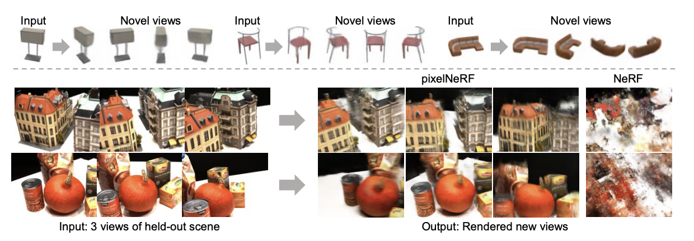
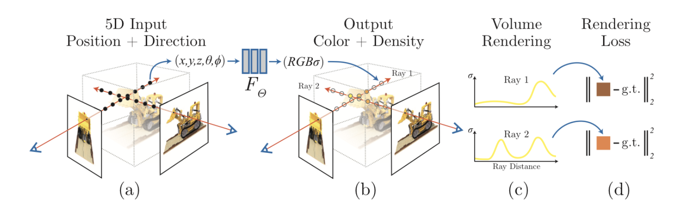
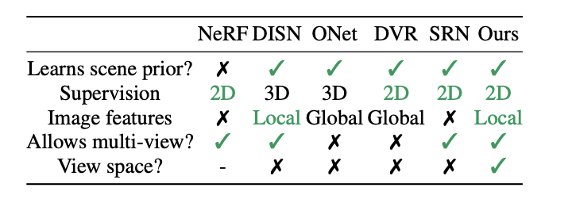
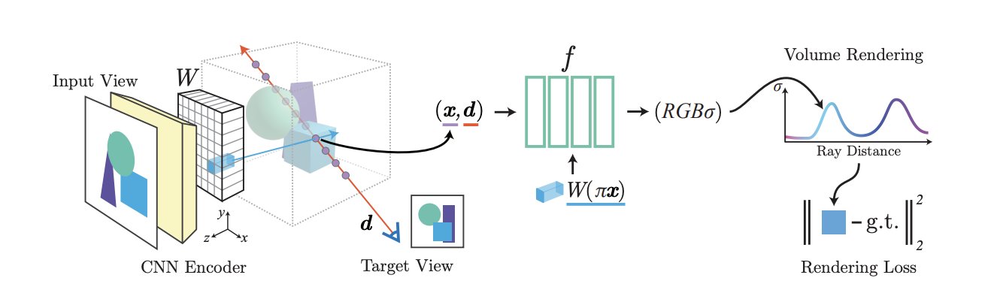
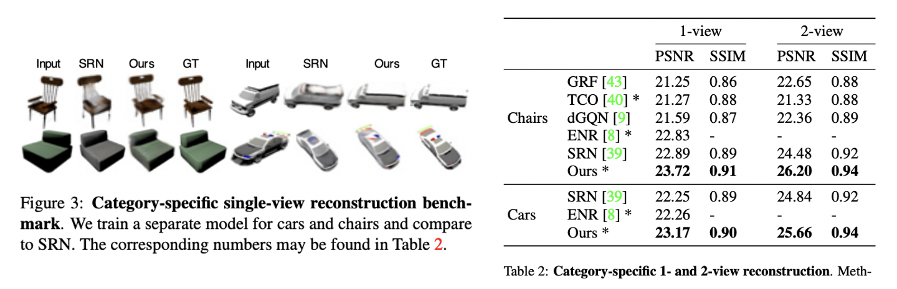
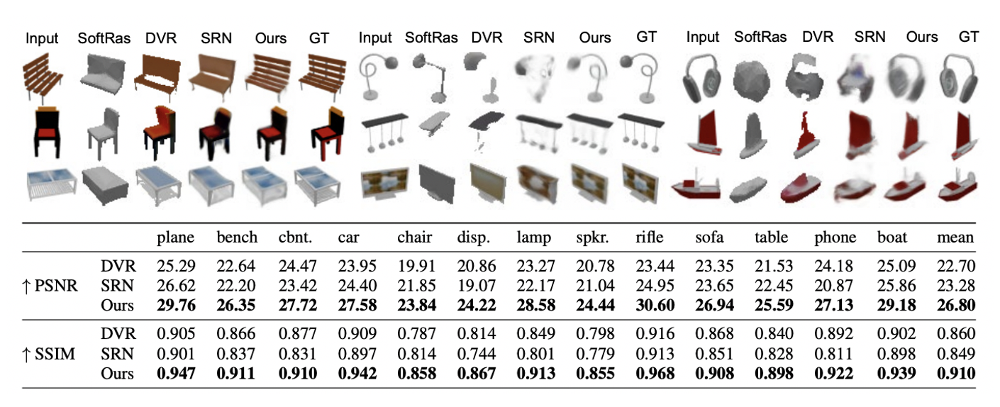
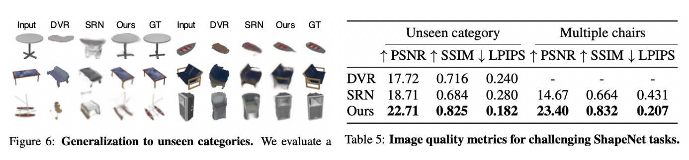
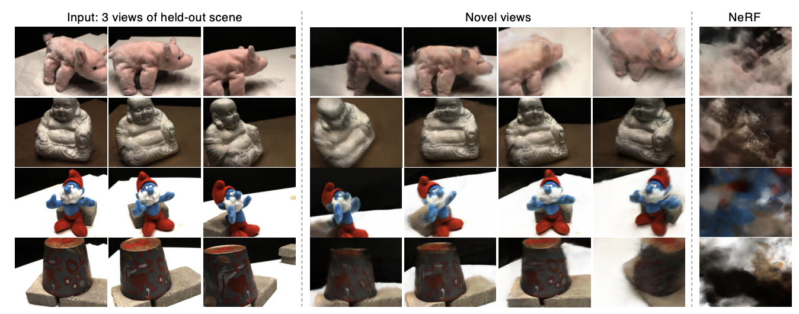

# pixelNeRF: Neural Radiance Fields from One or Few Images \[Kor]

**English version** of this article is available.

### 1. Introduction

오늘 소개할 논문은 PixelNeRF: Neural Radiance Fields from one or few images로 **view synthesis** 분야에 큰 발전을 이룬 **NeRF**(ECCV 2020)의 후속 연구입니다.&#x20;

#### 1.1 Problem Definition

**View Synthesis**

* 특정 각도에서 찍은 여러 사진들을 활용해 임의의 새로운 각도에서의 사진을 생성하는 task입니다.
* 이 문제가 간단해보일 수도 있지만,
* 이 문제는 ECCV 2020에서 발표된 NeRF를 바탕으로 새로운 국면을 맞았다.

**NeRF**

* NeRF 카메라를 이용해서 찍은 n개의 2D 이미지에서 빛과 원근감을 복원하여 새로운 각도에서 물체를 찍은 2D 이미지를 생성하는 view synthesis를 위한 모델입니다.
* 이 과정에서 input이 이미지의 coordinate $$(x,y,z)$$와 viewing direction $$d:(\theta,\phi)$$, output이 해당 pixel의 RGB value $$c$$ 와 volume density $$\sigma$$ 인 MLP를 사용합니다.
  * $$((x,y,z),(\theta, \phi)) \rightarrow (c, \sigma)$$
* 이때 한가지 주목할만한 특징은 pixel 위치마다의 RGB값을 하나의 행렬로 discrete하게 표현하는 것이 아니라, pixel 좌표에서 RGB값으로 변환해주는 하나의 함수를 학습하여 사용한다는 것입니다. 이러한 방법을 neural implicit representation(혹은 neural radiance field)라 부르며, super-resolution 등 다양한 CV분야에서 사용되고 있습니다.

> 자세한 설명은 아래 related works 파트를 확인해주세요 :)


#### 1.2 Motivation

엄청난 성능으로 큰 파장을 불러일으킨 NeRF이지만, 한계점도 존재합니다. 고품질 이미지를 합성하기 위해 하나의 객체에 대한 **여러 각도** 의 이미지가 필요하고, 긴 시간 동안 모델을 **최적화**해야한다는 것인데요. 오늘 소개할 pixel NeRF는 이런 NeRF의 한계점을 보완하면서 훨씬 더 짧은 시간에 훨씬 적은 수의 이미지 만으로 새로운 시점에서의 이미지를 생성하는 방법을 제안합니다.

적은 수의 이미지만으로도 그럴듯한 이미지를 생성할 수 있으려면, 각 scene들의 공간적인 관계를 모델이 학습할 수 있어야 합니다. 이를 위해 pixelNeRF는 이미지의 **spatial features**를 추출해 input으로 사용합니다. 즉, spatial features들이 view synthesis를 하기 위한 scene prior로서의 역할을 하는 것입니다. (이때 feature는 fully convolutional image feature를 사용합니다.)

아래 그림과 같이 pixelNeRF는 NeRF보다 더 적은 입력 이미지에 대해서도 훌륭한 결과를 생성한다는 것을 알 수 있습니다.



#### 1.2 Contribution

이 논문의 main contribution을 정리하면 다음과 같습니다.

* pixelNeRF can be trained on a dataset of multi-view images without additional supervision such as ground truth 3D shape or object masks.
* pixelNeRF predicts a NeRF representation in the camera coordinate system of the input image instead of a canonical coordinate frame.
* it is fully convolutional, allowing it to preserve the spatial alignment between the image and the output 3D representation.
* pixelNeRF can incorporate a variable number of posed input views at test time without requiring any test-time optimization

### 2. Related Work

#### NeRF

위에서 잠시 언급했듯이 NeRF는 view synthesis, 즉 이미지의 시점을 이동시키는 task를 위한 모델입니다. 이때, 새로운 각도에서의 2D 이미지를 생성하겠다는 것은 결국 3D object를 통째로 모델링 하겠다는 의미로 볼 수 있습니다. 이 모델링을 함에 있어서 NeRF는 neural radiance field (=neural implicit representation)라 불리는 "각 pixel 좌표 값을 input으로 주면 해당 위치의 RGB 값을 연산하는 함수의 형태"를 사용합니다. 여기서의 함수는 deep neural network입니다.

_(3D object는 2D와 달리 굉장히 sparse하므로 RGB값을 discrete한 행렬로 연산하는 것 보다 이와 같은 방법이 계산-효율적이라고 합니다.)_

```
$$
F_\Theta: (X,d) \rightarrow (c,\sigma)
$$
```

* Input: pixel의 위치 $$X \in \mathbb{R}^3$$ 와 보는 방향을 나타내는 unit vector $$d \in \mathbb{R}^3$$
* Output: color 값과 density $$\sigma$$

그렇다면, 함수 $$F_\Theta$$ 구한 color/density값으로 어떻게 새로운 이미지를 랜더링할까요?

함수로 연산한 color값은 3차원 좌표에서의 RGB값을 말합니다. 이때 다른 각도에서 바라본 2D 이미지를 생성하려면, (그 방향에서 바라보았을 때) 앞에 위치한 부분에 가려지거나, 뒤에 위치한 것이 비치는 경우 등을 고려해야 합니다. 바로 output으로 density가 필요한 이유이지요.

이러한 것들을 다 고려해 3차원에서의 RGB값들을 2D 이미지로 렌더링하는 수식이 아래와 같습니다.

$$
\hat{C}_r=\int_{t_n}^{t_f} T(t)\sigma(t)c(t)dt\
$$

**Notaion**

* camera ray $$r(t)=o+td$$
  * $$t$$: 실제 물체(원점)에서부터 구하고자 하는 사이의 거리.
  * $$d$$: viewing direction unit vector
  * $$o$$: origin
*   $$T(t)=exp(-\int_{t_n}^t\sigma(s)ds)$$

    : t점을 가로막고 있는 점들의 density의 합 ($$\approx$$ 광선이 다른 입자에 부딪히지 않고 $$t_n$$에서 $$t$$로 이동할 확률)
* $$\sigma(t)$$ : t 지점에서의 density값
* $$c(t)$$: t점에서의 RGB값

이렇게 구한 추정된 RGB값 $$\hat{C}_r$$과 실제 RGB값 $$C(r)$$ 의 차이로 loss를 계산하여 학습을 진행합니다. $$\mathcal{L}=\Sigma_r ||\hat{C}_r -C(r)||^2_2$$

이 과정들은 모두 미분이 가능하기에 gradient descent로 최적화 가능합니다.



그림을 통해 한번 더 정리하자면, 우선 (a) 2D이미지에서 3차원 좌표 (x,y,z) 및 direction d를 추출합니다. _추출 과정은 본 논문 저자의 이전 연구인 \[LL]를 따릅니다._ (b) 그 후 neural radiance field를 이용해 각 좌표에서의 color와 density값을 구합니다. (c) 위 식을 통해 3차원의 volume을 2차원의 이미지로 랜더링 합니다. (d) 이렇게 구한 각 2D 좌표에서의 RGB값을 ground truth와 비교하며 함수를 최적화합니다.  &#x20;

\*이 기본 구조 외에도 논문에선 positional encoding , hierarchical volume sampling등 성능 향상을 위한 다양한 기법들을 사용해 모델의 성능을 높이지만, 본 paper review의 주제를 벗어나므로 그 부분은 생략하도록 하겠습니다.\*&#x20;

> 여기까지가 본 논문에 대한 이해를 위해 필요한 기본적인 NeRF에 대한 설명입니다. 혹시나 이 설명이 부족하다 생각하신 분은 포스팅 아래 참고자료의 링크를 참고해주세요 :)

####

#### View synthesis by learning shared priors

PixelNeRF 이전에도 few-shot or single-shot view synthesis를 위해 학습된 prior를 사용하는 연구가 이미 존재하였다.

그러나, 대부분이 3차원이 아닌 2.5차원의 데이터를 사용하거나, interpolation을 활용해 depth 추정하는 고전적인 방법을 사용하였다. 3D 객체를 모델링함에 있어서도 (2D 이미지가 아닌) 3D object 전체에 대한 정보를 필요로 하거나 이미지의 global한 feature만 고려하는 등의 한계가 존재하였다. pixelNeRF는 이러한 기존 방법론의 단점들을 보완하였다.



또한, 대부분의 3D learning 방법들은 일정한 방향으로만 정렬되는 예측 공간 (object-centered coordinate system)을 사용했는데, 이런 경우 다양한 예측이 어렵다는 단점이 있다. pixelNeRF는 viewer-centered coordinate system을 차용하여 unseen object에 대해서도 reconstruction이 수월하도록 하였다.

### 3. Methodology

PixelNeRF의 구조는 크게 두 파트로 나눌 수 있습니다.

* fully-convolutional image encoder $$E$$ : input image를 pixel-aligned feature로 인코딩 하는 부분
* NeRF network $$f$$ : 객체의 색과 밀도를 연산하는 부분

인코더 $$E$$ 의 output값이 nerf network의 input으로 들어가게 되는데, 이 과정에 대해 이제 자세히 설명해보도록 하겠습니다.

#### 3.1 Single-Image pixelNeRF

이 논문은 pixelnerf를 single-shot과 multi-shot으로 나누어 학습방법을 소개합니다. 우선Single-image pixelNeRF부터 살펴보도록 합시다.

**Notation**

* $$I$$: input image
* $$W$$: extracted spatial feature $$=E(I)$$
* $$x$$: camera ray
* $$\pi(x)$$: image coordinates
* $$\gamma(\cdot)$$ : positional encoding on $$x$$

1. 우선 input image $$I$$ 를 encoder에 넣어 spatial feature vector W를 추출합니다.
2. 그 후 camera ray $$x$$ 위의 점들에 대해, 각각에 대응되는 image feature를 구합니다.
   * camera ray $$x$$ 를 이미지 평면에 projection시키고 이에 해당하는 좌표 $$\pi(x)$$ 구합니다.
   * 이 좌표 해당하는 spatial feature $$W(\pi(x))$$를 bilinear interpolation을 사용해 구합니다.
3. 이렇게 구한 $$W(\pi(x))$$ 와 $$\gamma(x), d$$ 를 NeRF network에 넣고 color와 density값을 구합니다.

$$
f(\gamma(x),d;W(\pi(x)))=(\sigma,c)\
$$

1. NeRF에서와 동일한 방법으로 volume rendering을 진행합니다.

즉, nerf와 달리 input에 대한 pre-processing을 통해 input image의 spatial feature를 추출하고 이것을 nerf network에 추가한다는 점이 기존 nerf와 차별화된 점이라 할 수 있습니다.



#### 3.2 Multi-view pixelNeRF

Few-shot view synthesis의 경우 여러 사진이 들어오기 때문에 query view direction을 통해 (target direction에 대한) 특정 image feature의 중요도를 볼 수 있다. 만약 input view와 target direction이 비슷하다면, 모델은 input으로 학습된 데이터를 바탕으로 추론하면 될 것이고, 그렇지 않다면 기존 학습된 prior를 활용해야 할 것이다.

기본적인 틀은 single-shot pixelNeRF와 동일하지만 아래와 같은 유념해야할 점들이 있다.

1. 우선 multi-view task를 풀기 위해 저자는 각 이미지들의 상대적인 카메라 위치를 알 수 있다고 가정한다.
2.  각각의 이미지 $I^{(i)}$ 속에서 원점에 위치한 객체들을 우리가 보고자하는 target 각도에서의 좌표에 맞게 변환한다.

    &#x20; $$P^{(i)} = [R^{(i)} \; t^{(i)}], \ x^{(i)}= P^{(i)}x$$, $$d^{(i)}= R^{(i)}d$$
3. encoder를 통해 feature를 뽑을 땐 각각의 view frame마다 독립적으로 뽑아 NeRF network에 넣고 NeRF network의 final layer에서 합친다. 이는 다양한 각도에서의 이미지에서 최대한 많은 spatial feature을 뽑아내기 위한 것이다.
   *   이를 수식으로 나타내기 위해 NeRF network의 initial layer를 $$f\_1$$, intermediate layer를 $$V^{(i)}$$, final layer를 $$f\_2$$ 라 하자.

       $$
       V^{(i)}=f_1(\gamma(x^{(i)}),d^{(i)}; W^{(i)}(\pi(x^{(i)}))) \\\ (\sigma,c)= f_2 (\psi(V^{(i)},...,V^{(n)}))\
       $$

       * $$\psi$$: average pooling operator

즉, multi-view pixelNeRF의 단순화 버전이 single-view pixelNeRF인 셈이다.

### 4. Experiments

**Baselines**

기존 few-shot/ single-shot view synthesis의 SOTA 모델이었던 SRN과 DVR. 그리고 비슷한 구조(neural radiance field)의 네트워크를 사용한 NeRF와 비교하며 pixelNeRF의 성능을 보여줍니다.

**Metrics**

이때 성능은 표준적으로 사용하는 image quality metric들을 사용하였습니다.

* PSNR: $$10 log_{10}(\frac{R^2}{MSE})$$​
* SSIM: $$\frac{(2\mu\_x \mu\_y + C\_1)(2\sigma\_{xy}+C\_2)}{(\mu\_x^2+ \mu\_y^2+ C\_1)(\sigma\_x^2+\sigma\_y^2+C\_2)}$$

**Implementation Details**

본 논문의 실험에선 imagenet에 pretrained된 resnet34 모델을 backbone network로 사용합니다. 4번째 pooling layer까지 feature를 추출하고, 그 이후 layer에선 (위 3에서 설명했듯이) 대응되는 좌표에 맞는 feature를 찾는 과정을 거칩니다. 이때, local한 feature와 global한 feature를 모두 사용하기위해, feature pyramid형태로 추출합니다. 여기서 feature pyramid란 서로 다른 해상도의 feature map을 쌓아올린 형태를 말합니다.

또한, NeRF network $$f$$에서도 ResNet구조를 차용하여 좌표 및 viewing direction $$\gamma(x), d$$를 먼저 입력하고 feature vector $$W(\phi(x))$$를 residual로써 각 ResNet block 앞부분에 더합니다.

***

크게 세가지의 실험을 통해 pixelNeRF의 성능을 잘 보여주었습니다.

1.  ShapeNet 벤치마크 데이터셋에서 category-specific한 경우와 category-agnostic한 경우 모두에서의 view synthesis를 시행하였습니다.

    

    

    * achieve new sota results for view synthesis and shapenet both setting. train a single model to the 13 largest categories of shapenet.
    * softras (comparing model) outputs a mesh of limited resolution and cannot represent arbitrary topologies
    * DVR uses an implicit surfaceto allow arbitrary topology it tends to misfind structure since it continues to use a single global latent vector. SRN does not use image features at all and instead requires a test time latent version step using ground truth absolute camera poses. pixelnerf catures more fine detail in both appearance and geometry compared to the baselines.
2.  학습된 prior를 통해 ShapeNet 데이터 내 unseen category혹은 multi-object data에 대해서도 view synthesis를 적용 가능함을 보였다.

    

    * Rather than using canonical space, using only relative camera poses both at training and test time. This choice of coordinate system also makes PixelNeRF applicable in more general settings. Training the model only on airplanes cars and chairs, we find that it can generalize to additional unseen object categories with superiorperformance compared to others.
    * Can also train through scenes of two signatures without further modification.
3.  DTU MVS dataset과 같은 실제 장면에 대해서도 view synthesis를 시행하였다.

    

    * Can apply a trained PixelNeRF to real cars in the sim to real setting without any fine tuning or camera estimation. Since the pixelnerf operates in view space and does not require mask supervision, it can also perform wide baseline view synthesis on complex real scenes from the DTU dataset using only 88 training scene

PixelNeRF can obtain some reconstruction from only one view and outputs better results with more observatios. In contrast, NERF fails to achieve reasonable results with very few views. Furthermore, pixelnerf results here are direct output of the network without test time optimization whereas training on nerf takes 14 hours for each scene and set of input views.

위 실험들을 통해 pixelNeRF가 ShapeNet과 같은 정형화된 3D dataset 뿐만 아니라, multi-object image, unseen image, real scene image등 다양한 환경에 적용할 수 있음이 증명되었다. 또한, 이 모든 과정이 기존 NeRF보다 훨씬 적은 이미지만으로도 가능함을 보였다.

### 5. Results

본 논문에서 제안한 pixelNeRF는 적은 수의 이미지 만으로도 view synthesis task를 잘 해결하기 위해 기존 NeRF에 scene prior를 학습하는 과정을 추가하여 NeRF를 비롯한 기존 view synthesis 모델들의 한계점을 보완하였습니다. 다양한 실험을 통해 pixelNeRF가 실제로도 다양한 환경에서 잘 작동함을 알 수 있습니다.

그러나, 몇가지 한계점들은 아직 존재하는데요. NeRF와 마찬가지로 rendering시간이 굉장히 오래걸리며, ray sampling bounds/positional encoding에 사용되는 parameter등을 수동으로 조정해야하기때문에 scale-variant합니다.또한, DTU dataset으로 real image에 대한 적용 가능성을 보였지만 DTU data도 제약된 상황에서만들어진 데이터 셋이기 때문에 실제로 굉장히 raw한 large-scale wide dataset에대해서도

#### Take home message

### 6. Author

**권다희 (Dahee Kwon)**

* KAIST AI
* Contact: \[email], \[github]

### 7. Reference & Additional materials
