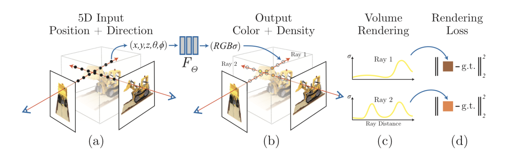
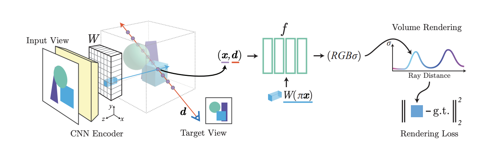

# pixelNeRF \[Eng]

[**한국어**](pixelnerf-kor.md)로 쓰인 리뷰를 읽으려면 여기를 누르세요.

### 1. Introduction

Today I'll introduce the paper [PixelNeRF: Neural Radiance Fields from one or few images](https://arxiv.org/abs/2012.02190), kind of follow-up paper of [**NeRF**(ECCV 2020)](https://arxiv.org/abs/2003.08934) that achieves great performance on **view synthesis** area. 

#### Problem Definition: View Synthesis

* View synthesis is a problem of reconstructing photo from new angle using multiple photos taken from other angles. When we take pictures, 3D objects in the real world are recorded as two-dimensional images. In the process, some information regarding the depth or amount of light received from the object is lost. 
* So to generate a image from new angle, we should infer and restore the rest of the information about model real-world objects based on given (limited) information. This problem is very difficult to solve because it is not just possible to create an image from a new angle by interpolating a given image, but also requires consideration of a variety of external factors.

* To date, NeRF is a SOTA algorithm on view synthesis task and get a lot of attention for its great performance.

### 2 Motivation

Before we look into pixelNeRF, let me explain more about NeRF and other related studies to find out which points pixelNeRF tried to improve.

#### 2.1 Related Work

#### NeRF

NeRF is a model for the task of restoring "light and perspective" from 2D images taken using a view synthesis, that is, a camera, to create 2D images of objects from a new angle. At this time, creating a 2D image from a new angle can mean modeling the entire 3D object. In this modeling, NeRF uses a "function that computes the RGB value of each pixel given its coordinate," called natural radius field ($$\approx$$ neural implicit reprsentation). The function here is defined as a deep natural network and can be expressed as the formula below.

(3D objects are very sparse unlike 2D iamges, so neural implicit representation kind of method is more efficient than computing RGB values into discrete matrices. Not only for 3D object reconstructing, the method is widely used in various CV fields such as super-resolution.)

$$
F_\Theta: (X,d) \rightarrow (c,\sigma)
$$

* Input: position of pixel $$X \in \mathbb{R}^3$$ and the viewing direction unit vector $$d \in \mathbb{R}^2$$
* Output: color value $$c$$ and density value $$\sigma$$

Then, How can we render a new image from the color and density values from $$F_\Theta$$ ?

The color values computed above mean the RGB value at 3D coordinates. At this time, in order to create a 2D image from a different angle, it is necessary to consider whether the 3D object is covered by the front part (from that viewing direction), or the back part is reflected. That's why we need to compute the density value through the function.
Considering all of these, the equation of converting RGB values in three dimensions into RGB values in 2D images is as follows.

$$
\hat{C}_r=\int_{t_n}^{t_f} T(t)\sigma(t)c(t)dt\
$$

**Notation**

* camera ray $$r(t)=o+td$$
  * $$t$$: how far the object is (from the focus)
  * $$d$$: viewing direction unit vector
  * $$o$$: origin
*   $$T(t)=exp(-\int_{t_n}^t\sigma(s)ds)$$

    : summation of the density values of the points blocking point $$t$$. ($$\approx$$ The probability that light rays will move from $t_n$$ to $t$$ without hitting other particles.)
    
* $$\sigma(t)$$ : density value on point $$t$$
* $$c(t)$$: RGB value on point $$t$$

The training proceeds by calculating the loss by the difference between the estimated RGB value $$\hat{C}_r$$ and the actual RGB value $C(r)$$.

$$
\mathcal{L}=\Sigma_r ||\hat{C}_r -C(r)||^2_2
$$

It is possible to optimize by gradient descent algorithm because every process is differentiable.

To summarize one more time through the figure, (a) extract three-dimensional coordinates (x, y, z) and direction d from the 2D image. _(The extraction process follows the author's previous study, [_LLFF_](https://arxiv.org/pdf/1905.00889.pdf))_ (b) After that, the color and density values at each coordinate are obtained using the natural radius field function. (c) Rendering the three-dimensional volume into a two-dimensional image through the equation described above. (d) Compare the RGB value at each coordinate with ground truth to optimize the function.

_In addition to this basic structure, the paper uses various techniques to improve performance, such as positional encoding and hierarchical volume sampling, but that part will be omitted as it is out of topic this paper review posting._

> This is the explanation of NeRF to understand this paper. If you think it is not enough, please refer to the link below. :)

####

#### View synthesis by learning shared priors

There have been various studies using learned priors for the few-shot or single-shot view synthesis before pixelNeRF. 

However, most of them uses 2.5 dimension of data, not 3 dimension, or just uses traditional methods (like estimating depth using interpolation). There are also several limitations in modeling 3D objects, such as requiring information about the entire 3D object (not 2D images) or considering only the global feature of the image. Furthermore, most 3D learning methods use an object-centered coordinate system that aligns only in a certain direction, which has the disadvantage of being difficult to predict. 
Pixel NeRF improved the performance of the model by supplementing these shortcomings of existing methodologies.

#### 2.2 Idea

It is a NeRF that made a huge wave on view synthesis fields with its high performance, but there are also limitations. In order to reconstruct high-quality images, multiple angles of images are needed for one object, and it takes quite long time to optimize the model. The pixel NeRF complements these limitations of NeRF and proposes a way to create images from a new point of view with only a small number of images in a much shorter time.

In order to be able to create a plausible image with only a small number of images, the model must be able to learn the **spatial relationship** of each scene. To this end, pixelNeRF extracts the spatial features of the image and uses it as input. At this time, the feature is a fully convolutional image feature.

As shown in the figure below, you can see that pixel NeRF produces great results even for fewer input images compared to NeRF.

### 3. Methods

Then let's move on to the PixelNeRF. The structure of the model can be largely divided into two parts.

* fully-convolutional image encoder $$E$$ : encoding input images into the pixel-aligned features
* NeRF network $$f$$ : computing the color and density values of object

The output of encoder $$E$$ goes into the input of nerf network. 

#### 3.1 Single-Image pixelNeRF

This paper introduces the method by dividing Pixelnerf into single-shot and multi-shot. 
First of all, let's take a look at Single-image pixel NeRF.

**Notation**

* $$I$$: input image
* $$W$$: extracted spatial feature $$=E(I)$$
* $$x$$: camera ray
* $$\pi(x)$$: image coordinates
* $$\gamma(\cdot)$$ : positional encoding on $$x$$

1. Extract the spatial feature vector W by putting input image $$I$$ into the encoder $$E$$. 
2. After that, for the points on camera ray $$x$$, we obtain the each corresponding image feature.
   * Project the camera ray $$x$$ onto image plane and compute the corresponding image coordinate $$\pi(x)$$.
   * Compute corresponding spatial feature $$W(\pi(x))$$ by using bilinear interpolation.
3. Put the $W(\pi(x))$$ and $\gamma(x)$ and d$$$ in the NeRF network and obtain the color and density values.

$$
f(\gamma(x),d;W(\pi(x)))=(\sigma,c)\
$$

4\. Do volume rendering in the same way as NeRF.

That is the main difference with NeRF is that the feature of the input image is extracted through pre-processing and added to the network.

#### 3.2 Multi-view pixelNeRF

Few-shot view synthesis의 경우, 여러 사진이 들어오기 때문에 query view direction을 통해 (target direction에 대한) 특정 image feature의 중요도를 볼 수 있습니다. 만약 input view와 target direction이 비슷하다면, 모델은 input으로 학습된 데이터를 바탕으로 추론하면 될 것이고, 그렇지 않다면 기존 학습된 prior를 활용해야 할 것입니다.

multi-view 모델 구조의 기본적인 틀은 single-shot pixelNeRF와 여러 이미지를 모두 고려하기 위해 달라지는 부분들이 있습니다.

In the case of the Few-shot view synthesis, multiple photos come in, so we can see the importance of a specific image feature through the query view direction. If the input and target direction are similar, the model can be inferred based on the input, otherwise you will have to utilize the existing learned prior.

The basic framework of the multi-view model structure is almost similar to the single-shot pixel NeRF, but there are some points to consider because of additional images.

1. First of all, in order to solve the multi-view task, it is assumed that we can know the relative camera location of each image.
2. Then we transform the objects coordimate (located at origin in each image $$I^{(i)}$$) to match the coordinates at the target direction we want to see.

    $$P^{(i)} = [R^{(i)} \; t^{(i)}], \ x^{(i)}= P^{(i)}x$$, $$d^{(i)}= R^{(i)}d$$
    
3. When extracting features through encoder, select them independently for each view frame, and put them in the NeRF network. In the final layer of the NeRF networ, we combine them. This is for extracting as many spatial features as possible from images from various angles.

   *   In the paper, to express this as an expression, we denote the initial layer of the NeRF network as $$f_1$$, the intermediate layer as $$V^{(i)}$$, and the final layer as $$f_2$$.

       $$
       V^{(i)}=f_1(\gamma(x^{(i)}),d^{(i)}; W^{(i)}(\pi(x^{(i)}))) \\\ (\sigma,c)= f_2 (\psi(V^{(i)},...,V^{(n)}))\
       $$

       * $$\psi$$: average pooling operator

> Single-view pixel NeRF is the simplified version of multi-view pixel NeRF.

### 4. Experiments

**Baselines & Dataset**

* Comparing pixelNeRF with SRN and DVR, which were SOTA models of the existing few-shot view synthesis, and NeRF, which uses similar networks structures.
* Experiments are conducted on ShapeNet, a benchmark dataset for 3D objects, and DTU datasets that resemble more real photos, showing the performance of pixelNeRF.

**Metrics**

For the performance indicator, widely used image qualifying metrics(PSNR, SSIM) are used. 

* PSNR: $$10 log_{10}(\frac{R^2}{MSE})$$
* SSIM: $$\frac{(2\mu_x \mu_y + C_1)(2\sigma_{xy}+C_2)}{(\mu_x^2+ \mu_y^2+ C_1)(\sigma_x^2+\sigma_y^2+C_2)}$$

**Training setup**

In the experiment of this paper, the reset34 model pretrained on the imagenet is used as the backbone network. Feature is extracted up to the $$4^{th}$$ pooling layer, and after that, the layer goes through the process of finding a feature that fits the corresponding coordinates (as described in 3 above). To use both local and global features, we extract features in the form of feature pyramid. (feature pyramid refers to a form in which feature maps of different resolutions are stacked.)

NeRF network $$f$$ also use the ResNet structure, putting the coordinate and viewing direction ($$\gamma(x), d$$) as inputs first and then add feature vector $$W(\phi(x))$$ as a residual at the beginning of each ResNet block.

In the paper, hree major experiments are conducted and shows the performance of pixel NeRF well.

1.  ShapeNet 벤치마크 데이터셋에서 category-specific한 경우와 category-agnostic한 경우 모두에서의 view synthesis를 시행하였습니다.

    

    하나의 pixelNeRF모델을 shapenet 내 가장 많은 13개의 카테고리에 대해 학습한 실험입니다. 위 결과를 보면 알 수 있듯이 pixelNeRF는 view synthesis의 측면에서 SOTA 결과를 보이고 있습니다. category-specific / category-agnostic한 경우 모두에서 가장 정교하고 그럴듯한 이미지를 생성하며, 이미지 성능 측도인 PSNR, SSIM 또한 가장 높은 수치를 보입니다.

2\. 학습된 prior를 통해 ShapeNet 데이터 내 unseen category혹은 multi-object data에 대해서도 view synthesis를 적용 가능함을 보였습니다.

모델을 자동차와 비행기 그리고 의자에 대해서만 학습을 시킨 후, 다른 카테고리에 대해 view synthesis를 진행한 결과입니다. 여기서도 pixelNeRF의 성능이 잘 나타남을 알 수 있습니다. 논문에선 이렇게 일반화 가능한 이유가 바로 canonical space가 아닌 카메라의 상대적인 위치(view space)를 사용했기 때문이라고 설명합니다.

3\. DTU MVS dataset과 같은 실제 장면에 대해서도 view synthesis를 시행하였습니다.

위 shapenet처럼 특정 물체에 대해 제한적으로 찍은 이미지가 이닌, 실제 이미지 데이터에 대해서도 scene 전체의 관점을 이동시키는 task도 비교적 잘 해냅니다. 88개의 학습 이미지 씬을 바탕으로 실험을 진행하여도 위와 같이 다양한 각도에서의 이미지를 만들어 냅니다. NeRF와 비교하면 적은 데이터로 전체 이미지 씬에 대한 모델링을 훨씬 잘 하고 있다는 것을 볼 수 있습니다.

위 실험들을 통해 pixelNeRF가 ShapeNet과 같은 정형화된 3D dataset 뿐만 아니라, multi-object image, unseen image, real scene image등 다양한 환경에 적용할 수 있음이 증명되었습니다. 또한, 이 모든 과정이 기존 NeRF보다 훨씬 적은 이미지만으로도 가능함도 보였습니다.

### 5. Conclusion

본 논문에서 제안한 pixelNeRF는 적은 수의 이미지 만으로도 view synthesis task를 잘 해결하기 위해 기존 NeRF에 scene prior를 학습하는 과정을 추가하여 NeRF를 비롯한 기존 view synthesis 모델들의 한계점을 보완하였습니다. 또한, 다양한 실험을 통해 pixelNeRF가 일반화된 다양한 환경(multi-objects, unseen category, real dataset etc.)에서 잘 작동함을 보였습니다.

그러나 아직도 몇가지 한계점들은 존재하는데요. NeRF와 마찬가지로 rendering시간이 굉장히 오래걸리며, ray sampling bounds/positional encoding에 사용되는 parameter등을 수동으로 조정해야하기때문에 scale-variant합니다. 또한, DTU에 대한 실험으로 real image에 대한 적용 가능성을 보였지만 이 데이터셋도 어느정도 제약된 상황에서 만들어졌기 때문에 굉장히 raw한 real dataset에대해서도 비슷한 성능을 낼 수 있을지는 아직 보장되지 않았습니다.

그럼에도 현재 많은 관심을 받고 있는 NeRF의 성능을 높이고 보다 일반화된 task로 확장시켰다는 점에서 충분히 의미있는 연구라 생각이 됩니다. 논문에 대한 설명을 읽고 궁금한 사항이 생기시면 언제든 아래 주소로 연락주시면 답변해드리겠습니다 :)

#### Take home message

* 최근 2D 이미지 만으로 실제 물체를 모델링해 여러 각도에서 보여주는 연구들이 활발히 진행되며 특히 neural implicit representation을 활용한 연구가 많은 관심을 받고 있다.
* 이때 주어진 이미지 내 pixel값 뿐만 아니라 이미지가 내포하고 있는 feature들을 추출해 사용하면 (복원력/효율성 측면에서 모두) 훨씬 더 좋은 성능을 낼 수 있다.

### 6. Author

**권다희 (Dahee Kwon)**

* KAIST AI
* Contact
  * email: [daheekwon@kaist.ac.kr](mailto:daheekwon@kaist.ac.kr)
  * github: [https://github.com/daheekwon](https://github.com/daheekwon)

### 7. Reference & Additional materials

* [NeRF paper](https://arxiv.org/abs/2003.08934)
* [NeRF 설명영상](https://www.youtube.com/watch?v=zkeh7Tt9tYQ)
* [pixelNeRF official site](https://alexyu.net/pixelnerf/)
* [pixelNeRF code](https://github.com/sxyu/pixel-nerf)

