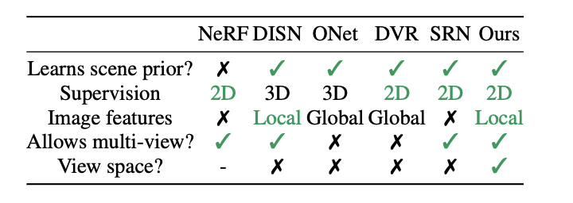
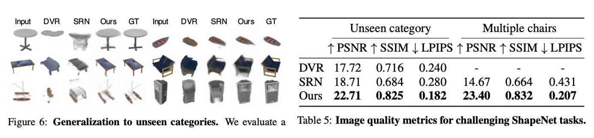

# pixelNeRF \[Eng]

[**한국어**](pixelnerf-kor.md)로 쓰인 리뷰를 읽으려면 여기를 누르세요.

### 1. Introduction

Today I'll introduce the paper [PixelNeRF: Neural Radiance Fields from one or few images](https://arxiv.org/abs/2012.02190), kind of follow-up paper of [**NeRF**(ECCV 2020)](https://arxiv.org/abs/2003.08934) that achieves great performance on **view synthesis** area. 

#### Problem Definition: View Synthesis

* 특정 각도에서 찍은 여러 사진들을 활용해 임의의 새로운 각도에서의 사진을 생성하는 문제입니다. 사진을 찍으면 현실 세계에서의 3d물체가 2차원의 이미지로 기록이 되는데요, 그 과정에서 물체의 깊이/받는 빛의 양 등에 대한 정보가 일부 소실되게 됩니다. 이렇게 주어진 (제한된) 정보들을 바탕으로 나머지 정보를 잘 추론하고 복원하여 현실 세계의 물체를 모델링하고, 이것을 다시 다른 각도에서의 2차원 이미지로 보여주는 것이라 이해하시면 될 것 같습니다. 이 문제는 단순히 주어진 이미지들을 interpolation한다고 하여 새로운 각도에서의 이미지를 만들 수 있는 것이 아닐 뿐더러 다양한 외부적인 요소들을 고려해야 하기때문에 굉장히 풀기 어려운 문제 중 하나입니다.

* View synthesis is a problem of reconstructing photo from new angle using multiple photos taken from other angles. When we take pictures, 3D objects in the real world are recorded as two-dimensional images. In the process, some information regarding the depth or amount of light received from the object is lost. 
* So to generate a image from new angle, we should infer and restore the rest of the information about model real-world objects based on given (limited) information. This problem is very difficult to solve because it is not just possible to create an image from a new angle by interpolating a given image, but also requires consideration of a variety of external factors.

* To date, NeRF is a SOTA algorithm on view synthesis task and get a lot of attention for its great performance.

### 2 Motivation

Before we look into pixelNeRF, let me explain more about NeRF and other related studies to find out which points pixelNeRF tried to improve.

#### 2.1 Related Work

#### NeRF

NeRF is a model for the task of restoring "light and perspective" from 2D images taken using a view synthesis, that is, a camera, to create 2D images of objects from a new angle. At this time, creating a 2D image from a new angle can mean modeling the entire 3D object. In this modeling, NeRF uses a "function that computes the RGB value of each pixel given its coordinate," called natural radius field ($$\approx$$ neural implicit reprsentation). The function here is defined as a deep natural network and can be expressed as the formula below.

(3D objects are very sparse unlike 2D iamges, so neural implicit representation kind of method is more efficient than computing RGB values into discrete matrices. Not only for 3D object reconstructing, the method is widely used in various CV fields such as super-resolution.)

$$
F_\Theta: (X,d) \rightarrow (c,\sigma)
$$

* Input: position of pixel $$X \in \mathbb{R}^3$$ and the viewing direction unit vector $$d \in \mathbb{R}^2$$
* Output: color value $$c$$ and density value $$\sigma$$

Then, How can we render a new image from the color and density values from the function $$F_\Theta$$ ?

The color values computed above mean the RGB value at 3D coordinates. At this time, in order to create a 2D image from a different angle, it is necessary to consider whether the 3D object is covered by the front part (from that viewing direction), or the back part is reflected. That's why we need to compute the density value through the function.
Considering all of these, the equation of converting RGB values in three dimensions into RGB values in 2D images is as follows.

$$
\hat{C}_r=\int_{t_n}^{t_f} T(t)\sigma(t)c(t)dt\
$$

**Notation**

* camera ray $$r(t)=o+td$$
  * $$t$$: how far the object is (from the focus)
  * $$d$$: viewing direction unit vector
  * $$o$$: origin
*   $$T(t)=exp(-\int_{t_n}^t\sigma(s)ds)$$

    : summation of the density values of the points blocking point $$t$$. ($$\approx$$ The probability that light rays will move from $t_n$$ to $t$$ without hitting other particles.)
    
* $$\sigma(t)$$ : density value on point $$t$$
* $$c(t)$$: RGB value on point $$t$$

The training proceeds by calculating the loss by the difference between the estimated RGB value $$\hat{C}_r$$ and the actual RGB value $C(r)$$.

$$
\mathcal{L}=\Sigma_r ||\hat{C}_r -C(r)||^2_2
$$

It is possible to optimize by gradient descent algorithm because every process is differentiable.

그림을 통해 한번 더 정리하자면, 우선 (a) 2D이미지에서 3차원 좌표 (x,y,z) 및 direction d를 추출합니다. (\_추출 과정은 본 논문 저자의 이전 연구인 \_[_LLFF_](https://arxiv.org/pdf/1905.00889.pdf)_를 따릅니다.)_ (b) 그 후 neural radiance field를 이용해 각 좌표에서의 color와 density값을 구합니다. (c) 위에서 설명한 식을 통해 3차원의 volume을 2차원의 이미지로 랜더링 합니다. (d) 이렇게 구한 각 2D 좌표에서의 RGB값을 ground truth와 비교하며 함수를 최적화합니다.

To summarize one more time through the figure, (a) extract three-dimensional coordinates (x, y, z) and direction d from the 2D image. _(The extraction process follows the author's previous study, [_LLFF_](https://arxiv.org/pdf/1905.00889.pdf))_ (b) After that, the color and density values at each coordinate are obtained using the natural radius field function. (c) Rendering the three-dimensional volume into a two-dimensional image through the equation described above. (d) Compare the RGB value at each coordinate with ground truth to optimize the function.

_In addition to this basic structure, the paper uses various techniques to improve performance, such as positional encoding and hierarchical volume sampling, but that part will be omitted as it is out of topic this paper review posting._

> This is the explanation of NeRF to understand this paper. If you think it is not enough, please refer to the link below. :)

####

#### View synthesis by learning shared priors

There have been various studies using learned priors for the few-shot or single-shot view synthesis before pixelNeRF. 

그러나, 대부분이 3차원이 아닌 2.5차원의 데이터를 사용하거나, interpolation을 활용해 depth 추정하는 고전적인 방법을 사용하였습니다. 3D 객체를 모델링함에 있어서도 (2D 이미지가 아닌) 3D object 전체에 대한 정보를 필요로 하거나 이미지의 global한 feature만 고려하는 등 여러 한계가 존재하였습니다. 또한, 대부분의 3D learning 방법들은 일정한 방향으로만 정렬되는 예측 공간 (object-centered coordinate system)을 사용했는데, 이런 경우 다양한 예측이 어렵다는 단점이 있습니다. pixelNeRF는 이러한 기존 방법론의 단점들을 보완하여 모델의 성능을 향상시켰습니다.

However, most of them uses 2.5 dimension of data, not 3 dimension, or just uses traditional methods (like estimating depth using interpolation). There are also several limitations in modeling 3D objects, such as requiring information about the entire 3D object (not 2D images) or considering only the global feature of the image. Furthermore, most 3D learning methods use an object-centered coordinate system that aligns only in a certain direction, which has the disadvantage of being difficult to predict. 
Pixel NeRF improved the performance of the model by supplementing these shortcomings of existing methodologies.

#### 2.2 Idea

It is a NeRF that made a huge wave on view synthesis fields with its high performance, but there are also limitations. In order to reconstruct high-quality images, multiple angles of images are needed for one object, and it takes quite long time to optimize the model. The pixel NeRF complements these limitations of NeRF and proposes a way to create images from a new point of view with only a small number of images in a much shorter time.

In order to be able to create a plausible image with only a small number of images, the model must be able to learn the **spatial relationship** of each scene. To this end, pixelNeRF extracts the spatial features of the image and uses it as input. At this time, the feature is a fully convolutional image feature.

As shown in the figure below, you can see that pixel NeRF produces great results even for fewer input images compared to NeRF.

### 3. Methodology

그럼 이제 PixelNeRF모델의 작동 메커니즘에 대해 알아봅시다. 모델의 구조는 크게 두 파트로 나눌 수 있습니다.

* fully-convolutional image encoder $$E$$ : input image를 pixel-aligned feature로 인코딩 하는 부분
* NeRF network $$f$$ : 객체의 색과 밀도를 연산하는 부분

인코더 $$E$$ 의 output값이 nerf network의 input으로 들어가게 되는 것이지요. 이제 이 과정에 대해 자세히 설명해보도록 하겠습니다.

#### 3.1 Single-Image pixelNeRF

이 논문은 pixelnerf를 single-shot과 multi-shot으로 나누어 학습방법을 소개합니다. 우선 Single-image pixelNeRF부터 살펴보도록 합시다.

**Notation**

* $$I$$: input image
* $$W$$: extracted spatial feature $$=E(I)$$
* $$x$$: camera ray
* $$\pi(x)$$: image coordinates
* $$\gamma(\cdot)$$ : positional encoding on $$x$$

1. 우선 input image $$I$$ 를 encoder에 넣어 spatial feature vector W를 추출합니다.
2. 그 후 camera ray $$x$$ 위의 점들에 대해, 각각에 대응되는 image feature를 구합니다.
   * camera ray $$x$$ 를 이미지 평면에 projection시키고 이에 해당하는 좌표 $$\pi(x)$$ 구합니다.
   * 이 좌표 해당하는 spatial feature $$W(\pi(x))$$를 bilinear interpolation을 사용해 구합니다.
3. 이렇게 구한 $$W(\pi(x))$$ 와 $$\gamma(x), d$$ 를 NeRF network에 넣고 color와 density값을 구합니다.

$$
f(\gamma(x),d;W(\pi(x)))=(\sigma,c)\
$$

4\. NeRF에서와 동일한 방법으로 volume rendering을 진행합니다.

즉, nerf와 달리 input에 대한 pre-processing을 통해 input image의 spatial feature를 추출하고 이것을 nerf network에 추가한다는 점이 기존 nerf와 차별화된 점이라 할 수 있습니다.

#### 3.2 Multi-view pixelNeRF

Few-shot view synthesis의 경우, 여러 사진이 들어오기 때문에 query view direction을 통해 (target direction에 대한) 특정 image feature의 중요도를 볼 수 있습니다. 만약 input view와 target direction이 비슷하다면, 모델은 input으로 학습된 데이터를 바탕으로 추론하면 될 것이고, 그렇지 않다면 기존 학습된 prior를 활용해야 할 것입니다.

multi-view 모델 구조의 기본적인 틀은 single-shot pixelNeRF와 여러 이미지를 모두 고려하기 위해 달라지는 부분들이 있습니다.

1. 우선 multi-view task를 풀기 위해 저자는 각 이미지들의 상대적인 카메라 위치를 알 수 있다고 가정합니다.
2.  각각의 이미지 $$I^{(i)}$$ 속에서 원점에 위치한 객체들을 우리가 보고자하는 target 각도에서의 좌표에 맞게 변환합니다.

    $$P^{(i)} = [R^{(i)} \; t^{(i)}], \ x^{(i)}= P^{(i)}x$$, $$d^{(i)}= R^{(i)}d$$
3. encoder를 통해 feature를 뽑을 땐 각각의 view frame마다 독립적으로 뽑아 NeRF network에 넣고 NeRF network의 final layer에서 합칩니다. 이는 다양한 각도에서의 이미지에서 최대한 많은 spatial feature을 뽑아내기 위한 것입니다.
   *   논문에선 이를 수식으로 나타내기 위해 NeRF network의 initial layer를 $$f_1$$, intermediate layer를 $$V^{(i)}$$, final layer를 $$f_2$$ 라 표기합니다.

       $$
       V^{(i)}=f_1(\gamma(x^{(i)}),d^{(i)}; W^{(i)}(\pi(x^{(i)}))) \\\ (\sigma,c)= f_2 (\psi(V^{(i)},...,V^{(n)}))\
       $$

       * $$\psi$$: average pooling operator

multi-view pixelNeRF의 단순화 버전이 single-view pixelNeRF인 셈입니다.

### 4. Experiments

**Baselines & Dataset**

* 기존 few-shot / single-shot view synthesis의 SOTA 모델이었던 SRN과 DVR, 그리고 비슷한 구조(neural radiance field)의 네트워크를 사용한 NeRF와 비교합니다.
* 3D 물체에 대한 벤치마크 데이터셋인 ShapeNet, 그리고 보다 실제 사진과 흡사한 DTU 데이터셋에 대해 모두 실험을 진행하며 pixelNeRF의 성능을 보여줍니다.

**Metrics**

이때 성능 지표로는 많이 사용하는 image qualifying metric들을 사용하였습니다.

* PSNR: $$10 log_{10}(\frac{R^2}{MSE})$$
* SSIM: $$\frac{(2\mu_x \mu_y + C_1)(2\sigma_{xy}+C_2)}{(\mu_x^2+ \mu_y^2+ C_1)(\sigma_x^2+\sigma_y^2+C_2)}$$

**Training setup**

본 논문의 실험에선 imagenet에 pretrained된 resnet34 모델을 backbone network로 사용합니다. 4번째 pooling layer까지 feature를 추출하고, 그 이후 layer에선 (위 3에서 설명했듯이) 대응되는 좌표에 맞는 feature를 찾는 과정을 거칩니다. 이때, local한 feature와 global한 feature를 모두 사용하기위해, feature pyramid형태로 추출합니다. 여기서 feature pyramid란 서로 다른 해상도의 feature map을 쌓아올린 형태를 말합니다.

또한, NeRF network $$f$$에서도 ResNet구조를 차용하여 좌표 및 viewing direction $$\gamma(x), d$$를 먼저 입력하고 feature vector $$W(\phi(x))$$를 residual로써 각 ResNet block 앞부분에 더합니다.

***

크게 세가지의 실험을 통해 pixelNeRF의 성능을 잘 보여주었습니다.

1.  ShapeNet 벤치마크 데이터셋에서 category-specific한 경우와 category-agnostic한 경우 모두에서의 view synthesis를 시행하였습니다.

    

    하나의 pixelNeRF모델을 shapenet 내 가장 많은 13개의 카테고리에 대해 학습한 실험입니다. 위 결과를 보면 알 수 있듯이 pixelNeRF는 view synthesis의 측면에서 SOTA 결과를 보이고 있습니다. category-specific / category-agnostic한 경우 모두에서 가장 정교하고 그럴듯한 이미지를 생성하며, 이미지 성능 측도인 PSNR, SSIM 또한 가장 높은 수치를 보입니다.

2\. 학습된 prior를 통해 ShapeNet 데이터 내 unseen category혹은 multi-object data에 대해서도 view synthesis를 적용 가능함을 보였습니다.

모델을 자동차와 비행기 그리고 의자에 대해서만 학습을 시킨 후, 다른 카테고리에 대해 view synthesis를 진행한 결과입니다. 여기서도 pixelNeRF의 성능이 잘 나타남을 알 수 있습니다. 논문에선 이렇게 일반화 가능한 이유가 바로 canonical space가 아닌 카메라의 상대적인 위치(view space)를 사용했기 때문이라고 설명합니다.

3\. DTU MVS dataset과 같은 실제 장면에 대해서도 view synthesis를 시행하였습니다.

위 shapenet처럼 특정 물체에 대해 제한적으로 찍은 이미지가 이닌, 실제 이미지 데이터에 대해서도 scene 전체의 관점을 이동시키는 task도 비교적 잘 해냅니다. 88개의 학습 이미지 씬을 바탕으로 실험을 진행하여도 위와 같이 다양한 각도에서의 이미지를 만들어 냅니다. NeRF와 비교하면 적은 데이터로 전체 이미지 씬에 대한 모델링을 훨씬 잘 하고 있다는 것을 볼 수 있습니다.

위 실험들을 통해 pixelNeRF가 ShapeNet과 같은 정형화된 3D dataset 뿐만 아니라, multi-object image, unseen image, real scene image등 다양한 환경에 적용할 수 있음이 증명되었습니다. 또한, 이 모든 과정이 기존 NeRF보다 훨씬 적은 이미지만으로도 가능함도 보였습니다.

### 5. Conclusion

본 논문에서 제안한 pixelNeRF는 적은 수의 이미지 만으로도 view synthesis task를 잘 해결하기 위해 기존 NeRF에 scene prior를 학습하는 과정을 추가하여 NeRF를 비롯한 기존 view synthesis 모델들의 한계점을 보완하였습니다. 또한, 다양한 실험을 통해 pixelNeRF가 일반화된 다양한 환경(multi-objects, unseen category, real dataset etc.)에서 잘 작동함을 보였습니다.

그러나 아직도 몇가지 한계점들은 존재하는데요. NeRF와 마찬가지로 rendering시간이 굉장히 오래걸리며, ray sampling bounds/positional encoding에 사용되는 parameter등을 수동으로 조정해야하기때문에 scale-variant합니다. 또한, DTU에 대한 실험으로 real image에 대한 적용 가능성을 보였지만 이 데이터셋도 어느정도 제약된 상황에서 만들어졌기 때문에 굉장히 raw한 real dataset에대해서도 비슷한 성능을 낼 수 있을지는 아직 보장되지 않았습니다.

그럼에도 현재 많은 관심을 받고 있는 NeRF의 성능을 높이고 보다 일반화된 task로 확장시켰다는 점에서 충분히 의미있는 연구라 생각이 됩니다. 논문에 대한 설명을 읽고 궁금한 사항이 생기시면 언제든 아래 주소로 연락주시면 답변해드리겠습니다 :)

#### Take home message

* 최근 2D 이미지 만으로 실제 물체를 모델링해 여러 각도에서 보여주는 연구들이 활발히 진행되며 특히 neural implicit representation을 활용한 연구가 많은 관심을 받고 있다.
* 이때 주어진 이미지 내 pixel값 뿐만 아니라 이미지가 내포하고 있는 feature들을 추출해 사용하면 (복원력/효율성 측면에서 모두) 훨씬 더 좋은 성능을 낼 수 있다.

### 6. Author

**권다희 (Dahee Kwon)**

* KAIST AI
* Contact
  * email: [daheekwon@kaist.ac.kr](mailto:daheekwon@kaist.ac.kr)
  * github: [https://github.com/daheekwon](https://github.com/daheekwon)

### 7. Reference & Additional materials

* [NeRF paper](https://arxiv.org/abs/2003.08934)
* [NeRF 설명영상](https://www.youtube.com/watch?v=zkeh7Tt9tYQ)
* [pixelNeRF official site](https://alexyu.net/pixelnerf/)
* [pixelNeRF code](https://github.com/sxyu/pixel-nerf)

